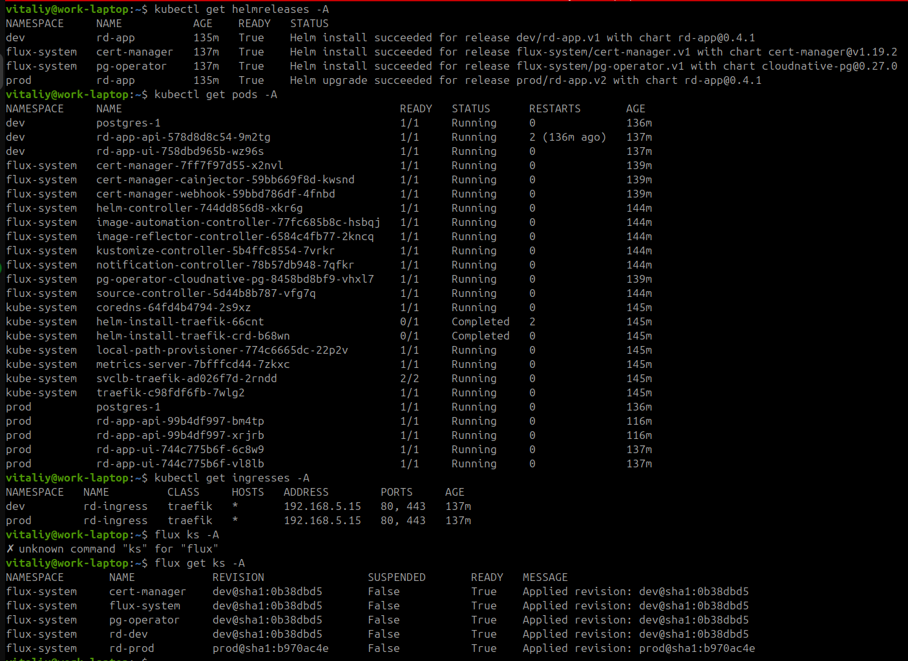

### PROD ENV
[](https://github.com/Avramenko-Vitaliy/rd-capstone/actions/workflows/build-api.yml)
[](https://github.com/Avramenko-Vitaliy/rd-capstone/actions/workflows/build-ui.yml)

### DEV ENV
[](https://github.com/Avramenko-Vitaliy/rd-capstone/actions/workflows/build-api.yml)
[](https://github.com/Avramenko-Vitaliy/rd-capstone/actions/workflows/build-ui.yml)

# Project Description

This project implements a GitOps-based deployment infrastructure using FluxCD for continuous delivery.

## Project Structure

```text
.
├── assets/             # Static assets (images, etc.)
├── infra/              # Infrastructure as Code (FluxCD, Kustomize)
│   ├── apps/           # Application manifests (base & overlays)
│   ├── charts/         # Helm charts
│   ├── clusters/       # Cluster-specific configurations
│   └── infrastructure/ # Shared components (cert-manager, cnpg)
├── todo-api/           # Backend API service (Java/Maven)
└── todo-ui/            # Frontend User Interface (React/TS)
```

## Database

PostgreSQL database managed by a PostgreSQL operator (pg-operator).

## Automation

### GitHub Actions

GitHub Actions CI/CD pipeline builds and pushes Docker images for the application components (UI and API) to the
container registry on every commit to the repository.

### FluxCD ImageUpdateAutomation

FluxCD ImageUpdateAutomation automatically updates container images across environments:

- **Dev environment**: Monitors and updates from `dev` branch
- **Prod environment**: Monitors and updates from `prod` branch

The automation runs every 10 minutes and commits image updates back to the respective Git branches.

## Infrastructure

- Deployments managed via Kustomize overlays (dev/prod)
- Certificate management via cert-manager
- Target namespaces: `dev`, `prod` and `flux-system`

## Proofs of working

